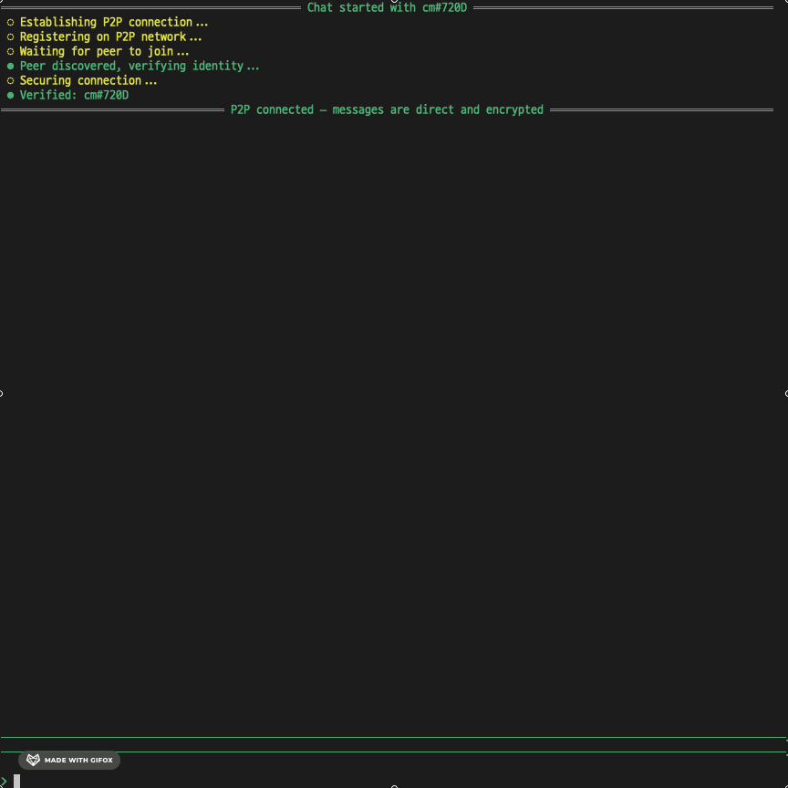
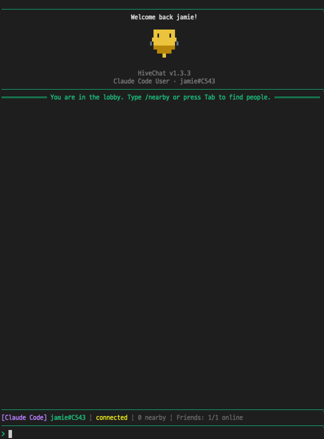
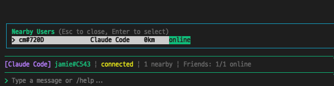
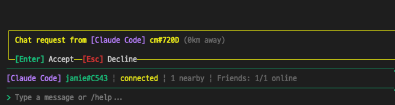
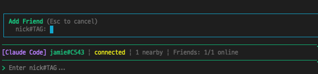

# HiveChat

**Meet your terminal friends.**

[](https://www.npmjs.com/package/hivechat)
[](LICENSE)
[](https://nodejs.org)

HiveChat is a CLI peer-to-peer chat tool that connects you with developers nearby. Built for people who live in the terminal — discover someone within 10km and start chatting, without ever leaving your workflow.

<p align="center">
  
</p>

## Quick Start

```bash
npx hivechat
```

That's it. No signup, no install, no config. Just one command.

> Requires Node.js 20+

## How It Works

### 1. Launch and land in the lobby

Run `npx hivechat`, pick a nickname, and you're in. The lobby shows your profile and connection status at a glance.

<p align="center">
  
</p>

### 2. Find developers nearby

Type `/nearby` or press `Tab` to scan for developers within **10km of your location**. HiveChat uses server-side IP geolocation to automatically detect who's around you — no GPS, no manual setup. If someone is coding nearby, they'll show up here with their distance, AI CLI tool, and online status.

<p align="center">
  
</p>

### 3. Send or receive a chat request

Select a user to chat with, or wait for someone to reach out. Chat requests show who's calling and how far they are. Accept with `Enter`, decline with `Esc`.

<p align="center">
  
</p>

### 4. Chat directly — peer to peer

Once connected, messages travel **directly between you and your peer** via Hyperswarm, encrypted with Noise Protocol. The server never sees your messages. When the session ends, messages are gone forever.

### 5. Build your friend list

Met someone interesting? Add them by `nick#tag` so you can see when they're online and chat again anytime.

<p align="center">
  
</p>

## Why HiveChat?

- **Discover nearby developers** — Automatically finds people within 10km using IP geolocation. No manual location sharing needed
- **True P2P** — Messages go directly between peers, encrypted via Noise Protocol. The server handles discovery only
- **Zero trace** — Nothing is stored anywhere. When the session ends, messages vanish completely
- **One command** — `npx hivechat`. No accounts, no installation, no configuration

## Architecture

```
┌─────────────┐       ┌──────────────┐       ┌─────────────┐
│  Terminal A  │──P2P──│  Hyperswarm  │──P2P──│  Terminal B  │
│  (Client)    │       │  (DHT)       │       │  (Client)    │
└──────┬──────┘       └──────────────┘       └──────┬──────┘
       │                                            │
       └────── Signal Server (Fly.io) ──────────────┘
                 discovery only, no messages
```

- **Signal Server** — User discovery and P2P connection coordination only. Never relays or stores messages
- **Hyperswarm** — Encrypted peer-to-peer messaging via Noise Protocol and DHT-based NAT traversal
- **Ephemeral** — All messages exist only in memory and vanish when the session ends

## Commands

| Command | Description |
|---------|-------------|
| `/nearby` | Find developers near you |
| `/friends` | View your friend list |
| `/addfriend` | Add a friend by nick#tag |
| `/removefriend` | Remove a friend |
| `/help` | Show all commands |
| `/leave` | Leave current chat |
| `/settings` | Change nickname or AI CLI |
| `/exit` | Quit HiveChat |

## Features

| Feature | Description |
|---------|-------------|
| **10km Discovery** | Finds developers nearby via server-side IP geolocation |
| **P2P Encrypted Chat** | Direct messaging via Hyperswarm, no server relay |
| **Friends** | Add by nick#tag, see real-time online/offline status |
| **CJK/IME Support** | Full Korean, Japanese, and Chinese input |
| **Responsive TUI** | Adapts to any terminal size |
| **Security** | P2P identity verification, DDoS protection, rate limiting |
| **Auto Update Check** | Notifies when a new version is available |

## Tech Stack

| Layer | Technology |
|-------|-----------|
| Runtime | Node.js >= 20 |
| Language | TypeScript (strict, ESM-only) |
| TUI | Ink 6 + React 19 |
| P2P | Hyperswarm 4 |
| Signaling | ws (WebSocket) |
| Geolocation | geoip-lite (server-side) |
| Validation | Zod |
| Config | conf (XDG-compliant) |
| Build | tsdown |
| Test | Vitest (300+ tests) |

## Project Structure

```
packages/
  client/     # CLI client (published to npm as hivechat)
  server/     # Lightweight signal server (deployed to Fly.io)
  shared/     # Protocol types + Zod schemas
```

## Development

```bash
git clone https://github.com/jameshin1212/hive-chat.git
cd hive-chat
npm install
npm run build
node packages/client/bin/hivechat.js
```

Run tests:

```bash
npm test
```

## License

[MIT](LICENSE)
